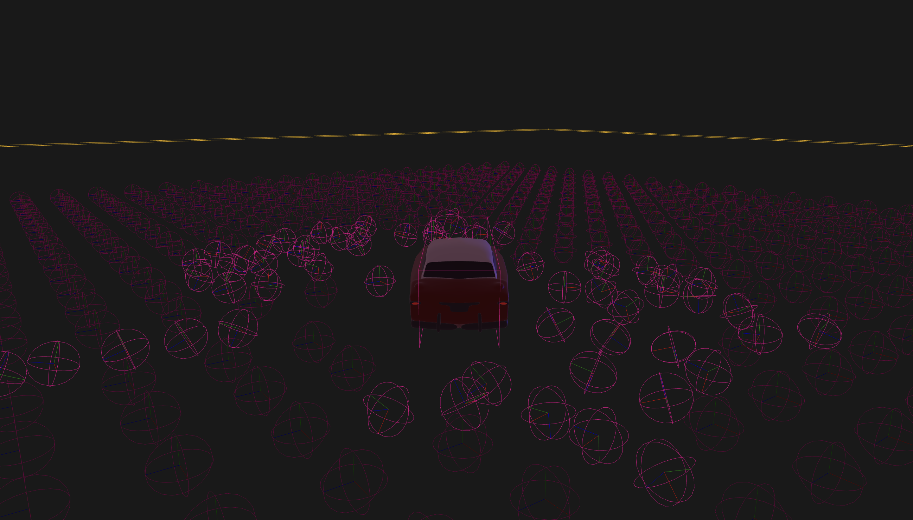

# Car Balls

I am in the process of learning some Rust, along with the Bevy graphics engine
and the Rapier physics engine. My ultimate goal is to create some weird flying car game (cars flying in space). Maybe with O'Neill cylinders and other retro-futurist stuff. I'm an OpenTTD fan, so I wonder if I should also add some space trains. 

Now you can see I have a couple of big ideas, and I'm not sure if I'll actually have time to code all of this. But as an intermediate step, here is a car with some keyboard controls and a bunch of balls. The result is quite fun! You can drive around and hit balls.

All of this runs in the browser thanks to webassembly.

# Try it

You can try it here: https://antoinemopa.github.io/car_balls/ - Use arrows, hit balls*

\* there is no game logic whatsoever, no points.

# Project name

I honestly could not come up with a better name and I'm too lazy to change it. I am not affiliated with any car decoration company. 
